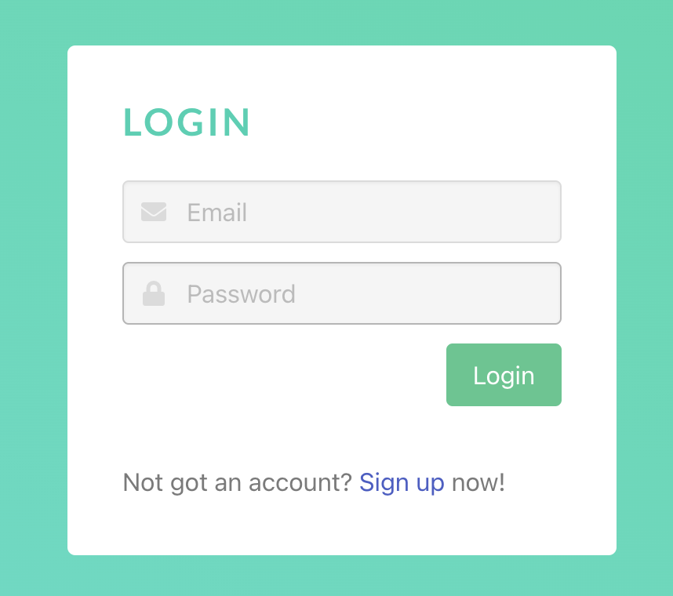
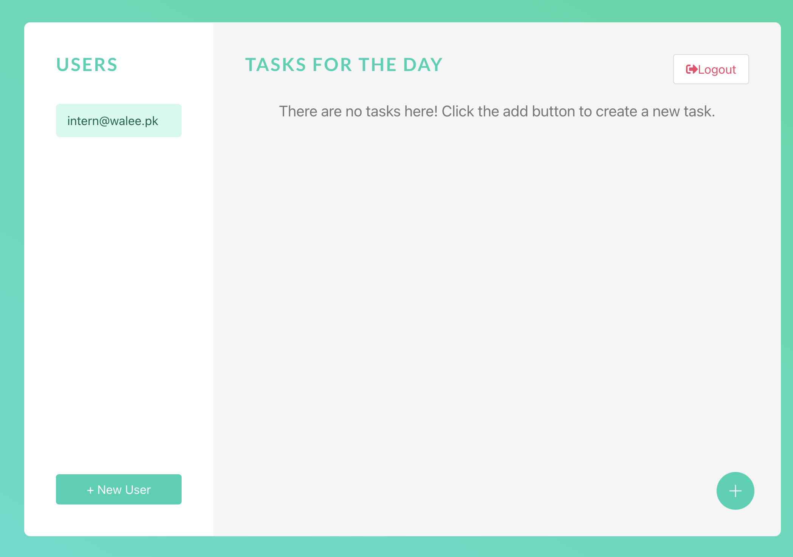
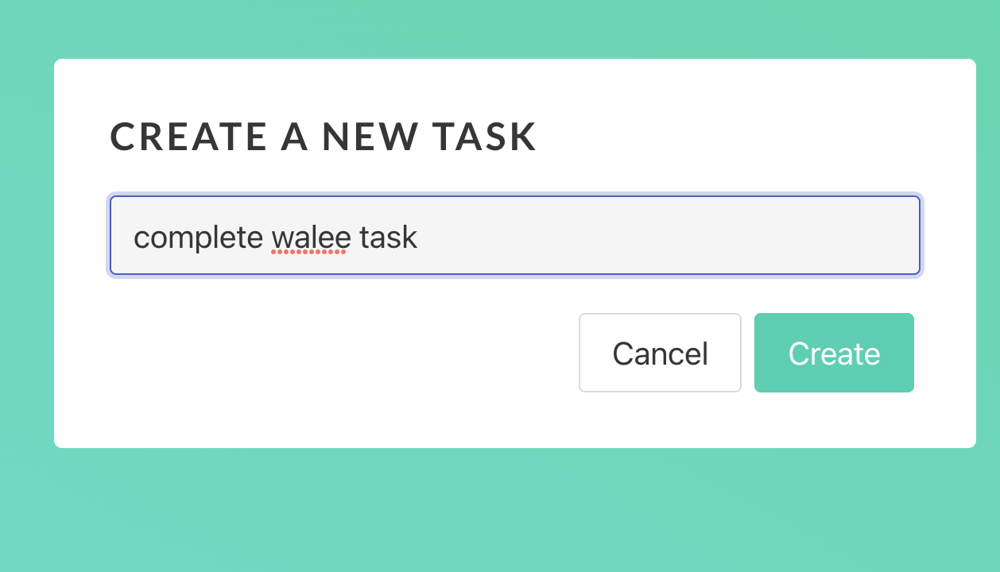

# Task Manager for teams built with Mean Stack

This project was built on top of tutorial by [DevStackr](https://www.youtube.com/watch?v=V-CeWkz1MNQ&list=PLIjdNHWULhPSZFDzQU6AnbVQNNo1NTRpd)

## Introduction

A team can setup their accounts using signup and then add team members. The admin can assign tasks to team members. 
The team members can login and view their tasks.

### Constraints

- Form validation
- Admin can add, delete and edit tasks
- Team member can only edit tasks and create new tasks. He cannot delete an assigned task.

## UI

## How to run?

### Backend

- Install required packages with `npm install`
- Run the backend wih `nodemon start` and make sure it is connected at port 3000

### Frontend

- Run frontend by running `ng serve` 
